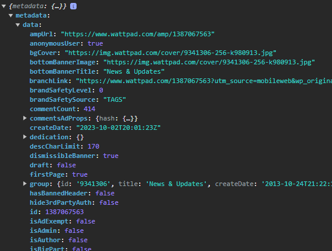

# WattpadConnect for Python

Unfortunately, the wattpad API no longer exists for programmers who are not familiar with wattpad.
WattpadConnect is an alternative interface that can still be used to retrieve data from the wattpad platform easily & for free.
It is extremely easy to use and you can get almost all data from wattpad with it.
Ingenious, isn't it?

With this interface, you can get data from this URLs:
- wattpad.com/chapteridxyz
- wattpad.com/story/storyidxyz
- wattpad.com/user/useraliasxyz

**Notice: This software is not endorsed or affiliated with Wattpad.**

JavaScript version here: [WattpadConnect for JavaScript](https://github.com/felixApps/WattpadConnect-JavaScript)

Overview:

- [WattpadConnect for Python](#wattpadconnect-for-python)
  - [❗DISCLAIMER❗](#disclaimer)
  - [🤷‍♂️ How to use it?](#%EF%B8%8F-how-to-use-it)
    1. [Import it](#import-it)
    2. [Get JSON](#get-json)
    3. [Use JSON](#use-json)
  - [👉 Examples](#-examples)
    1. [scheme wattpad.com/chapteridxyz](#wattpadcomchapteridxyz)
    2. [scheme wattpad.com/story/storyidxyz](#wattpadcomstorystoryidxyz)
    3. [scheme wattpad.com/user/useraliasxyz](#wattpadcomuseruseraliasxyz)
  - [🪲 BUGS](#-bugs)

## ❗DISCLAIMER❗
Use of this software is at your own risk.
The author of this software disclaims all warranties,
whether expressed or implied, as to the functionality,
security, or legality of the software.

Please be aware that the use of this software may be in
violation of Wattpad's terms of service, which explicitly
prohibit scraping, crawling, or any other method to remove
content from any part of the Site or Services.
It is your responsibility to ensure that your use of
the software complies with applicable laws and Wattpad's terms of service.

The author of this software expressly disclaims any liability
for damages, legal consequences, or losses resulting from the
use of the software. Use this software at your own discretion.

It is advisable to use the software only for lawful purposes and in
accordance with applicable laws and regulations.


## 🤷‍♂️ How to use it?
It's very simple.

1. #### Import it: 
Download the `WattpadConnect.py` file and import it:
```python
import WattpadConnect
```
Don't forget to replace "path/to/api.js" with the path of the api.js file.

2. #### Get JSON:
To get data, just run the function with the URL.
You can extract information from the following URLs:
- wattpad.com/chapteridxyz
- wattpad.com/story/storyidxyz
- wattpad.com/user/useraliasxyz
E.g. to get data about a wattpad user:
```python
userdata = WattpadConnect.extractInformationFromWattpad('https://www.wattpad.com/user/username')
```
Replace 'username' with the username of the user which informations you want to get.
Now, `userdata` contains a JSON with all the user's data.

3. #### Use JSON:
So now you got a whole JSON, but how to get the data?
To extract the single informations, use this (example):
```python
# gets the user's avatar image url:
avatar = userdata["metadata"]["data"][0]["avatar"]
# gets the user's description:
description = userdata["metadata"]["data"][0]["description"]
```
Scroll down to see more examples:

## 👉 Examples

Okay, let's start by importing WattpadConnect:
`main.py`
```python
import WattpadConnect
```
Now lets add some code:
```python
import WattpadConnect

json = WattpadConnect.extractInformationFromWattpad('https://www.wattpad.com/1387067563')
print(json)
```

Lets take a look at the JSONs structure:


You are now confronted with a huge pile of data.
Let's see how you can extract the most important data.

1. #### wattpad.com/chapteridxyz:

So, in this scheme the "chapteridxyz" stands for the chapter id of the story.

Example URL: [https://www.wattpad.com/1387067563](https://www.wattpad.com/1387067563)

The URL can also include the story name and/or part(chapter) name, it doesn't matter.

`main.py`:
```python
# basic: get the json and print it
import WattpadConnect

json = WattpadConnect.extractInformationFromWattpad('https://www.wattpad.com/1387067563')
print(json)

# save the most important data in variables:
storytext = json["metadata"]["data"]["storyText"]
title = json["metadata"]["data"]["title"]
currentpage = json["metadata"]["data"]["pageNumber"]
pages = json["metadata"]["data"]["pages"] # how much pages has the CURRENT part?
pagetext = str(currentpage) + " / " + str(pages) # optional: if you want to show your users on which page they are
storytitle = json["metadata"]["data"]["group"]["title"]
storycover = json["metadata"]["data"]["group"]["cover"] # returns the URL to the image
readcount = json["metadata"]["data"]["readCount"]
commentcount = json["metadata"]["data"]["commentCount"]
votescount = json["metadata"]["data"]["voteCount"]
completed = json["metadata"]["data"]["group"]["completed"] # true or false
description = json["metadata"]["data"]["group"]["description"]
parts = json["metadata"]["data"]["group"]["parts"]; # returns an array, you may want to program a function that processes it
nextparturl = json["metadata"]["data"]["nextPart"]["url"]; # only aviable if there's a next part
authorname = json["metadata"]["data"]["group"]["user"]["name"]
authoravatar = json["metadata"]["data"]["group"]["user"]["avatar"] # returns the URL to the image
authoralias = json["metadata"]["data"]["group"]["user"]["username"]
authorlink = "https://www.wattpad.com/user/" + authoralias
```

So yes, now you know how to save the data in variables.
How they are further processed is entirely up to you.

2. #### wattpad.com/story/storyidxyz

In this scheme, the "storyidxyz" stands for the story's ID.
Example: [https://www.wattpad.com/story/9341306-news-updates](https://www.wattpad.com/story/9341306-news-updates)

`main.py`:
```python
# basic: get the json and print it
import WattpadConnect

json = WattpadConnect.extractInformationFromWattpad('https://www.wattpad.com/1387067563')
print(json)

# save the most important data in variables:
storytitle = json["metadata"]["data"]["group"]["title"]
description = json["metadata"]["data"]["group"]["description"]
cover = json["metadata"]["data"]["group"]["cover"] # returns the URL to the image
completed = json["metadata"]["data"]["group"]["completed"]; # returns true or false
parts = json["metadata"]["data"]["group"]["parts"]; # returns an array, you may want to program a function that processes it
authorname = json["metadata"]["data"]["group"]["user"]["name"]
authorlink = "https://www.wattpad.com/user/" + json["metadata"]["data"]["group"]["user"]["username"]
authoravatar = json["metadata"]["data"]["group"]["user"]["avatar"] # returns the URL to the image
```

3. #### wattpad.com/user/useraliasxyz

In this scheme, the "useraliasxyz" stands for the user's username.
Example: [https://www.wattpad.com/user/Wattpad](https://www.wattpad.com/user/Wattpad)

`main.py`:
```python
name = json["metadata"]["data"][0]["name"]
alias = json["metadata"]["data"][0]["username"]
avatar = json["metadata"]["data"][0]["avatar"] # returns the URL to the image
background = json["metadata"]["data"][0]["backgroundUrl"] # returns the URL to the image
description = json["metadata"]["data"][0]["description"]
createdate = json["metadata"]["data"][0]["createdate"] # returns ISO 8601 standard
followingcount = json["metadata"]["data"][0]["followingtotal"] # returns a number
following = json["metadata"]["data"][0]["following"] # returns an array, you may want to program a function that processes it
followerscount = json["metadata"]["data"][0]["numFollowers"] # returns a number
location = json["metadata"]["data"][0]["location"]
stories = json["works"] # returns an array, you may want to program a function that processes it
verified = json["metadata"]["data"][0]["verified"] # returns true or false
```


## 🪲 BUGS
This are the known bugs:

| Bug Name                                   | Bug description                                                                 |
|:--------------------------------------------|:---------------------------------------------------------------------------------|
| story text incomplete | When the part is a little larger, the storytext variable doesn't contain the whole story part's text. Then, it only contains it til the page is full. In such a case, you just need to run it again but with a /page/pagenumber behind the URL. Example: https://www.wattpad.com/1387067563/page/2. Then this contains the text til the page is full again. And so it goes on, until at some point the next part begins.
| user's stories incomplete | Unfortunately, the array returned with json.metadata.data[0].stories can only have a maximum of three elements. So, if the user has written more than three stories, only three will be displayed anyway. With json.metadata.data[0].stories.total the complete number of published stories can be calculated.
| no reading lists and conversations aviable | coming soon.